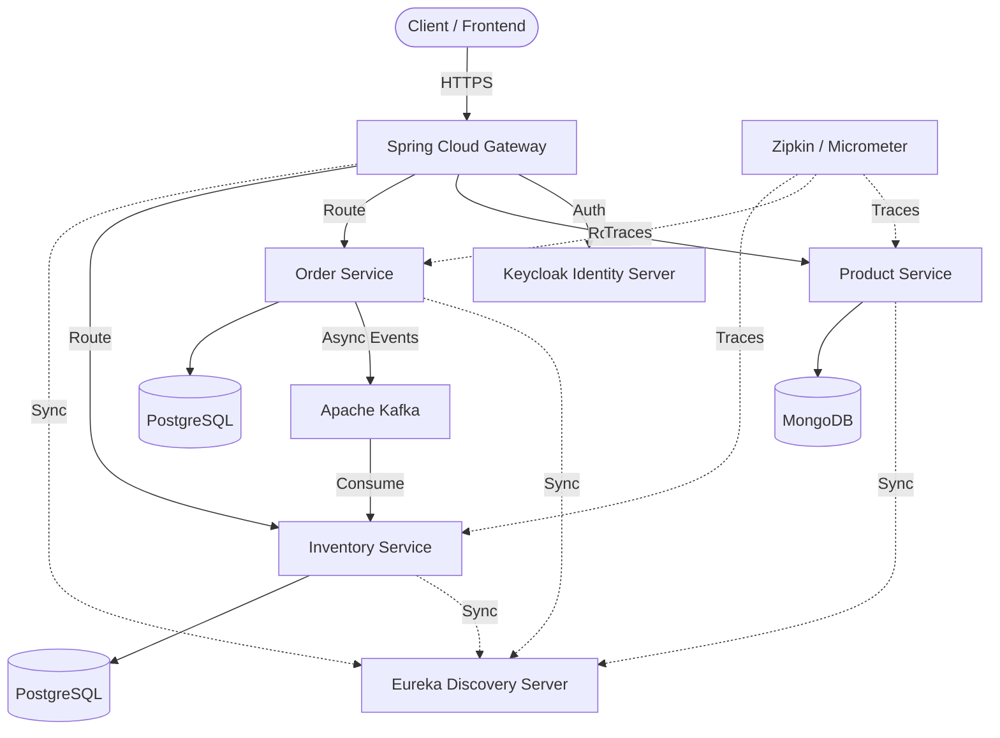

# 🛒 E-Commerce Microservices Platform


A state-of-the-art, robust, and scalable E-Commerce Microservices Platform built with **Java 25** and **Spring Boot 4.x**. This project embraces **Domain-Driven Design (DDD)**, event-driven architecture, and cloud-native patterns to deliver a production-ready baseline for modern e-commerce systems.

---

## ✨ Key Features

- **Microservices Architecture**: Strictly adheres to the database-per-service pattern.
- **Event-Driven Integration**: Asynchronous communication utilizing Apache Kafka.
- **Centralized Security**: OAuth2 Resource Server integration with **Keycloak** and JWT validation.
- **Service Discovery**: Spring Cloud Netflix **Eureka** for dynamic service registration.
- **API Gateway**: Centralized routing, filtering, and edge security with Spring Cloud Gateway.
- **Distributed Tracing**: Comprehensive observability using **Zipkin**, **Micrometer**, and Spring Boot Actuator.
- **Infrastructure as Code**: Fully containerized environments using Docker and Docker Compose.

---

## 🏗️ Architecture Overview



---

## 🛠️ Tech Stack

| Category | Technologies |
|---|---|
| **Core** | Java 25, Spring Boot 4.x |
| **Cloud & Routing** | Spring Cloud, Spring Cloud Gateway, Eureka Discovery Server, OpenFeign |
| **Messaging** | Apache Kafka |
| **Data Persistence** | PostgreSQL, MongoDB |
| **Security** | Keycloak, OAuth2, JWT |
| **Observability** | Zipkin, Micrometer, Spring Boot Actuator |
| **Infrastructure** | Docker, Docker Compose |

---

## 📁 Architecture Standards

Our microservices strictly follow a **Layered Architecture** and **Domain-Driven Design** principles:

`Controller` ➡️ `Service` ➡️ `Repository` ➡️ `Domain` ➡️ `Mapper` ➡️ `DTO`

**Backend Coding Standards:**
- Strict use of **Constructor Injection** (No field injection `@Autowired`).
- Robust validation and global exception handling mechanisms.
- Service-owned databases (no database sharing between microservices).

---

## 🚀 Getting Started

### Prerequisites
- JDK 25
- Docker & Docker Compose
- Maven or Gradle

### 1. Start Infrastructure Services
Bring up the necessary platform infrastructure (Kafka, Keycloak, Databases, Zipkin):
```bash
docker-compose up -d
```

### 2. Start Discovery & Config Servers
1. Start the **Config Server** (provides centralized application configuration).
2. Start the **Eureka Discovery Service** (runs locally on `http://localhost:8761`).

### 3. Start Core Microservices
Run the application microservices (Gateway, Product, Order, etc.) via your IDE or command line.

---

## 🛡️ Security

Endpoints are protected via Keycloak Role-based authorization. To access secure endpoints:
1. Obtain a JWT token from the local Keycloak server.
2. Pass the token in the `Authorization` header as a `Bearer` token.

---

## 📊 Observability

- **Eureka Dashboard**: `http://localhost:8761`
- **Zipkin Tracing**: View distributed traces for latency and cross-service request monitoring.
- **Actuator Endpoints**: Health checks available at `/actuator/health` on all running services.
